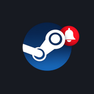

# Game News — Millennium plugin

<p align="center"></p>

A [Millennium](https://steambrew.app) plugin for the **Steam Desktop client** that
adds a **NEWS** entry to the top navigation. Clicking it opens your personal
**Game News** feed full-page inside Steam — the latest news for the games you
follow, plus follow management and settings — without leaving the client and
without breaking the native Store / Library / Community / Profile tabs.

It also surfaces native Steam toasts for fresh news and "new game detected →
click to follow" prompts while Steam is open.

## Features

- **NEWS** button injected into the Steam header, styled like a native tab.
- Full feed rendered **inside Steam** (plugin-owned route + iframe) — never
  hijacks the native tabs' browser.
- Clicking a news article opens it in Steam's **native** Community/Store tab.
- Follow / unfollow games and edit notification settings directly from the feed.
- Native toasts for new news and follow prompts; presence heartbeat for
  mobile/desktop notification de-duplication.

## How it works

- The frontend runs in Steam's `SharedJSContext` and is built with
  [`@steambrew/ttc`](https://steambrew.app).
- A small **Lua backend** (`backend/main.lua`) reads the signed-in SteamID from
  Steam's own `config/loginusers.vdf` and proxies HTTP to the Game News API
  (the Steam Client CSP blocks direct `fetch` to non-Steam origins).
- All data is keyed by SteamID against the public Game News backend.

## Install (users)

Once [Millennium](https://steambrew.app) is installed, install this plugin from
**Millennium → Settings → Plugins**, then restart Steam. The **NEWS** button
appears in the header.

> Manual install: copy this folder to
> `…/Steam/millennium/plugins/game-news/`, enable it in Millennium, restart Steam.

## Build (developers)

```bash
npm install
npm run build      # production build → .millennium/Dist/index.js
npm run dev        # development build
```

Deploy the built `index.js` to your Steam plugins folder and restart Steam to
test.

## Project layout

| Path | Role |
|------|------|
| `frontend/index.tsx` | Plugin frontend (NEWS button, feed route, toasts, polling) |
| `webkit/index.tsx` | Webkit-context entry (placeholder) |
| `backend/main.lua` | Lua backend: reads SteamID, proxies HTTP |
| `plugin.json` | Millennium plugin manifest |
| `.millennium/Dist/` | Built output loaded by Millennium |

## Privacy

The plugin sends your public SteamID to the Game News backend to fetch your
feed and manage follows. See the privacy policy:
**https://gamenews.up.railway.app/privacy** (and the
[terms](https://gamenews.up.railway.app/terms)).

## License

MIT — see [LICENSE](LICENSE).
